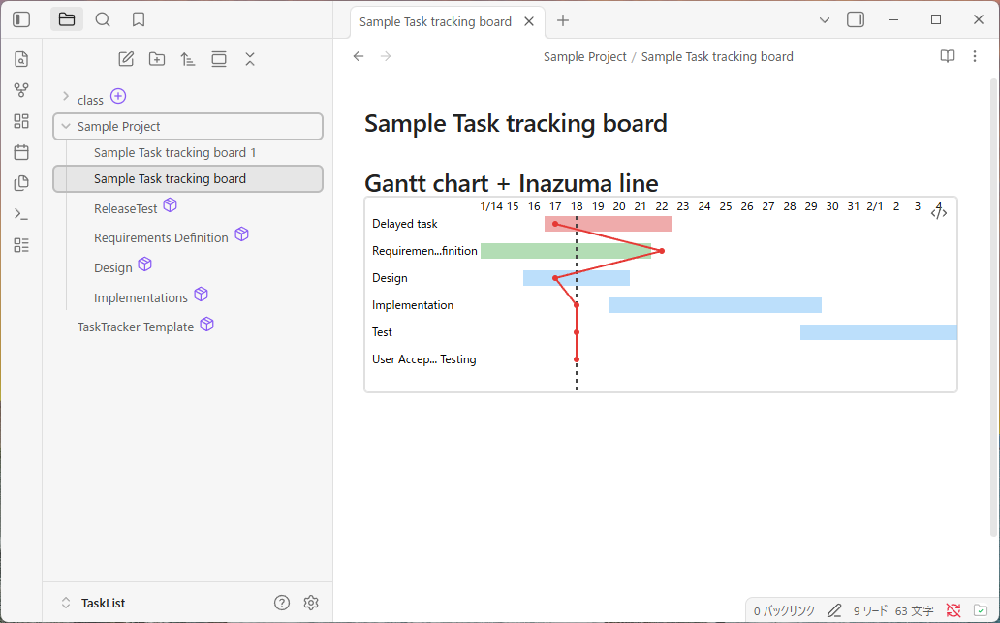
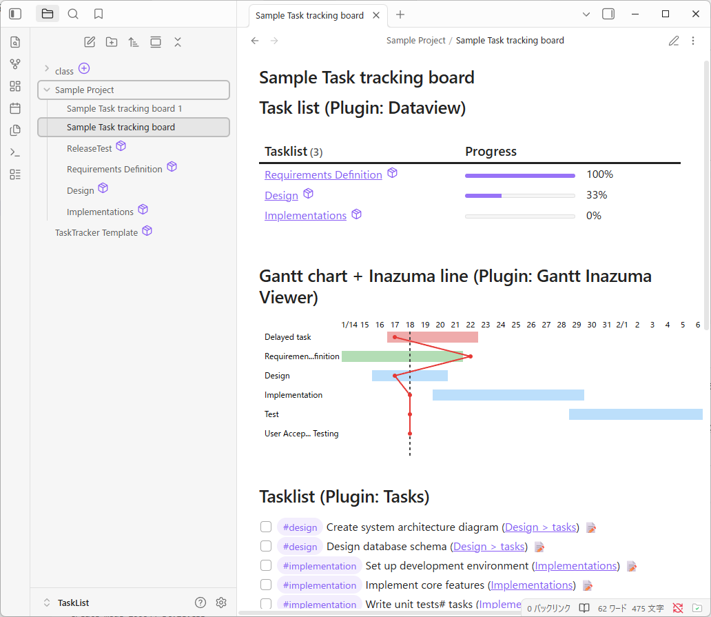

## TL;DR

[EN](README.md) | [日本語ドキュメントはこちら](README_jp.md)  
**Visualize planned vs. actual progress on a Gantt chart with progress lines**
It helps you instantly see schedule delays and advances at a glance.

The red zigzag line in the image above is the **Inazuma Line** —  
a visual indicator of planned vs actual progress.

Based on the vertical **today line**, it:
- moves **left** when work is delayed
- moves **right** when work is ahead of schedule

This lightning-like shape makes schedule deviations easy to spot at a glance.

## Introduction

[Sample Vault](https://github.com/segfo/obsidian-gantt-inazuma/releases/tag/v1)
This plugin adds an **Inazuma Line** - a *planned vs actual progress line* — to Gantt charts in Obsidian for visual schedule tracking.

The Inazuma Line is a visual technique for managing schedule variance:

* A vertical **today line** represents the current date on the Gantt chart
* When a task is **behind schedule**, the line shifts **to the left**
* When a task is **ahead of schedule**, the line shifts **to the right**
* When actual progress matches the plan, the line **overlaps the today line**

By connecting these deviations across tasks, the line forms a **zigzag pattern** that clearly shows where and how the schedule diverges from the plan.

## Why “Inazuma” Line?

“Inazuma” (稲妻) means **lightning** in Japanese.

The name comes from the way the line behaves on a Gantt chart:
as delays and advances occur, the line zigzags left and right, resembling the shape of a lightning bolt.

This lightning-like shape makes schedule deviations immediately visible and easy to understand at a glance.

## Features

* 📊 Display Gantt charts in Obsidian
* ⚡ Visualize planned vs actual progress with an Inazuma Line
* 📅 Uses a clear “today line” as a reference point
* 👀 Instantly identify schedule delays and advances

## Terminology

**Inazuma Line** is a project management concept commonly used in Japan.
Since there is no widely accepted English equivalent, this plugin keeps the original name and explains the concept for international users.

## Dashboard Example

## Why not Earned Value Management (EVM)?

Earned Value Management (EVM) is a powerful and widely used method for tracking
project performance using numerical metrics such as cost and schedule variance.

However, EVM often requires:

* detailed estimates
* continuous data updates
* familiarity with EVM-specific concepts and calculations

The Inazuma Line takes a different approach.

Instead of numerical analysis, it focuses on **visual, intuitive understanding**.
By showing schedule deviations directly on a Gantt chart, it allows users to see
whether work is ahead of or behind schedule **at a glance**, without complex metrics.

This plugin does not aim to replace EVM.
It is designed for lightweight planning, personal projects, and situations where
**clarity and simplicity** matter more than formal analysis.

## Background

Many task management and Gantt chart tools exist, but very few focus on
visual planned vs actual tracking.

In Japan, there is a long-standing project management practice called the
Inazuma Line, which visualizes schedule deviations directly on a Gantt chart.
When tasks fall behind or move ahead of schedule, the line zigzags like lightning,
making progress differences immediately visible.

This approach is intuitive and widely understood in Japanese project management,
yet it is rarely found in tools used in English-speaking communities.

This plugin was created to bring this traditional Japanese visual progress-tracking method
into Obsidian.

## License

MIT
